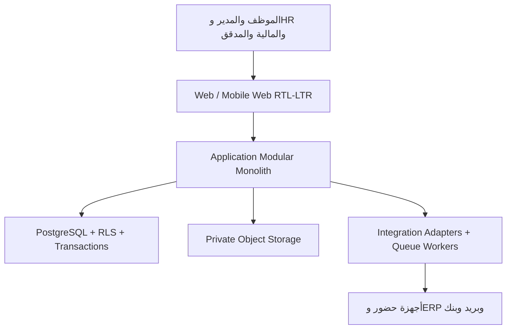

# PART 3 — PRODUCT ARCHITECTURE

**التاريخ:** 8 سبتمبر 2026. **الإصدار:** 0.1 — معمارية منتج مبدئية.

**المرجع:** [PART 2 — Product Strategy](PART_02_PRODUCT_STRATEGY.ar.md)، [نطاق MVP ومعايير القبول](MVP_SCOPE_AND_ACCEPTANCE.ar.md)، و[كتالوج الباقات](plan-catalog.draft.json).

**الحالة:** قرار معماري مبدئي قابل للتنفيذ والمراجعة. لا يعلن جاهزية الإنتاج، ولا يغير الكود أو مخطط Supabase تلقائيًا.

## 1. النتيجة المعمارية المستهدفة

نحتاج نظامًا يضمن أن العملية المالية تبدأ من واقعة تشغيلية موثقة وتنتهي بقرار يمكن مراجعته، مع عزل منشآت العملاء. المعمارية ليست مجموعة تقنيات منفصلة؛ هي حدود تمنع أن تنشئ شاشة الحضور بند راتب مباشرًا أو أن تمنح الباقة صلاحية مالية.

القرار المبدئي هو **Modular Monolith متعدد المستأجرين**: تطبيق واحد وبيئة نشر واحدة في البداية، مقسم داخليًا إلى مجالات أعمال بحدود وواجهات واضحة، مع PostgreSQL كمرجع معاملات. نضيف Queue/Worker للأعمال التي يمكن إعادة تشغيلها أو تستغرق وقتًا، ونؤجل Microservices حتى يثبت سبب تشغيلي أو تنظيمي حقيقي.

هذا الاختيار يحافظ على سرعة الفريق واستثمار المشروع الحالي، ويجعل المعاملة الواحدة بين الحضور والإجازة والرواتب ممكنة دون شبكة خدمات موزعة. حدود المجالات تمنع الاعتماد العشوائي، وتسمح باستخراج خدمة مستقلة لاحقًا إذا أصبحت الحاجة مثبتة.

## 2. حقائق خط الأساس وملاحظات الفجوة

| الملاحظة                                                                                                                                      | الدليل الحالي                                                                                                                                                                                                                                                                                                                                                | قرار معماري نحتاجه                                                                                         |
| --------------------------------------------------------------------------------------------------------------------------------------------- | ------------------------------------------------------------------------------------------------------------------------------------------------------------------------------------------------------------------------------------------------------------------------------------------------------------------------------------------------------------ | ---------------------------------------------------------------------------------------------------------- |
| الواجهة React 19 وTypeScript وTanStack Router/Start مع React Query                                                                            | [router.tsx](https://github.com/orabi1996/full-project-focus/blob/d3c855537490400667b406baaa14ce0ab0ccf43f/src/router.tsx)، [package.json](https://github.com/orabi1996/full-project-focus/blob/d3c855537490400667b406baaa14ce0ab0ccf43f/package.json)                                                                                                       | اعتماد مسارات فعلية وQuery/Mutation لكل مجال بدل تحميل الحالة كلها                                         |
| Supabase يوفر PostgreSQL وRLS وAuth وStorage، وتوجد Server Functions ومجموعة مسارات API                                                       | [start.ts](https://github.com/orabi1996/full-project-focus/blob/d3c855537490400667b406baaa14ce0ab0ccf43f/src/start.ts)، [client.server.ts](https://github.com/orabi1996/full-project-focus/blob/d3c855537490400667b406baaa14ce0ab0ccf43f/src/integrations/supabase/client.server.ts)                                                                         | فصل عميل المستخدم عن service role، وحصر التجاوزات في وظائف خادم موثقة                                      |
| `AppContext.tsx` يحمل حالة الوحدات والبيانات التجريبية ومهامًا كثيرة؛ يبلغ 2,220 سطرًا في خط الأساس المحلي                                    | [AppContext.tsx](https://github.com/orabi1996/full-project-focus/blob/d3c855537490400667b406baaa14ce0ab0ccf43f/src/lib/context/AppContext.tsx)                                                                                                                                                                                                               | تفكيك تدريجي إلى Query keys وfeature services؛ لا إعادة كتابة شاملة قبل تثبيت العقود                       |
| مخطط المؤسسة الحالي يستخدم `companies` و`subsidiaries`، وتظهر في migration أولية سياسات قراءة عامة `USING (true)` ثم migrations لاحقة للتشديد | [المخطط المؤسسي](https://github.com/orabi1996/full-project-focus/blob/d3c855537490400667b406baaa14ce0ab0ccf43f/supabase/migrations/20260830170000_hrms_enterprise_schema.sql)، [security hardening](https://github.com/orabi1996/full-project-focus/blob/d3c855537490400667b406baaa14ce0ab0ccf43f/supabase/migrations/20260831113000_security_hardening.sql) | لا نعد بالعزل قبل اختبار جميع migrations بالترتيب على عميلين؛ يعتمد الهدف على `tenant_id` وmembership وRLS |
| Helper functions انتقلت إلى `private_sec` في migration لاحقة                                                                                  | [migration نقل الدوال](https://github.com/orabi1996/full-project-focus/blob/d3c855537490400667b406baaa14ce0ab0ccf43f/supabase/migrations/20260901081607_eb500a1c-59f7-4e1b-b7af-8738b692b94d.sql)                                                                                                                                                            | مراجعة ترتيب migrations ومراجع الدوال قبل أي staging؛ لا نعتبر الانتقال دليلًا على اكتمال العزل            |
| وظائف الأعمال تستدعي Supabase مباشرة من ملفات `*.functions.ts`                                                                                | [attendance.functions.ts](https://github.com/orabi1996/full-project-focus/blob/d3c855537490400667b406baaa14ce0ab0ccf43f/src/lib/business/attendance.functions.ts) و[payroll.functions.ts](https://github.com/orabi1996/full-project-focus/blob/d3c855537490400667b406baaa14ce0ab0ccf43f/src/lib/business/payroll.functions.ts)                               | وضع طبقات command/query وrepositories وحدود transaction؛ لا يكتب UI الجداول الحساسة مباشرة                 |
| يوجد مسار public للبصمة يستخدم service role                                                                                                   | [public biometric punch](https://github.com/orabi1996/full-project-focus/blob/d3c855537490400667b406baaa14ce0ab0ccf43f/src/routes/api/public/biometric/punch.ts)                                                                                                                                                                                             | جهاز موقّع/مفتاح مخصص، idempotency، حدود طلب، ومراقبة؛ service role لا يدخل مسارًا عامًا بلا ضوابط         |

هذه قراءة معمارية للخط الأساس وليست تدقيقًا أمنيًا أو اختبارًا وظيفيًا. كل ملاحظة تُحوّل إلى بوابة قبول أو مهمة في الأجزاء التالية.

## 3. سياق النظام



**مسار الطلب:** المتصفح يرسل Command أو Query typed إلى الخادم؛ middleware يثبت الجلسة وtenant؛ Policy وvalidation تراجعان الفعل؛ Application Service ينفذ معاملة أو يسجل Job؛ Repository يقرأ/يكتب من PostgreSQL؛ Outbox يسجل حدثًا في نفس المعاملة؛ Worker يعالج الإشعار أو الموصل؛ الواجهة تعيد Query بعد تأكيد الحفظ.

**قاعدة الثقة:** المتصفح مصدر إدخال وعرض فقط. لا يُستخدم `currentRole` أو feature flag في المتصفح لمنح صلاحية، ولا يرسل العميل service-role key. الباقة تقيد الاستحقاق التجاري بعد اجتياز `released + entitlement + permission + tenant scope`.

## 4. حدود المجالات Bounded Contexts

التفصيل الموسع للكيانات والأحداث في [خريطة المجالات](PRODUCT_DOMAIN_MAP.ar.md). كل مجال يملك قواعده وCommands وQueries؛ يستهلك من مجالات أخرى عبر DTO أو حدث موثق بدل استيراد جداولها عشوائيًا.

| المجال                     | يملك                                                                 | Commands رئيسية                                                  | Events يخرجها                                                       | يعتمد على                                      |
| -------------------------- | -------------------------------------------------------------------- | ---------------------------------------------------------------- | ------------------------------------------------------------------- | ---------------------------------------------- |
| Identity & Access          | المستخدم، الدعوة، العضوية، الدور، النطاق، الجلسة الحساسة             | InviteUser, AssignRole, RevokeSession                            | UserInvited, RoleChanged, SessionRevoked                            | Tenant                                         |
| Tenant & Organization      | tenant، الكيان، الشركة الفرعية، الموقع، القسم، مركز التكلفة، التقويم | CreateTenant, ConfigureEntity, PublishOrgChange                  | TenantCreated, OrgChanged                                           | Identity                                       |
| People & Employment        | الشخص، العقد، الراتب الساري، الحساب المرتبط، دورة الخدمة             | HireEmployee, ChangeContract, EndEmployment                      | EmployeeHired, ContractChanged, EmploymentEnded                     | Tenant, Identity                               |
| Time & Attendance          | الوردية، الإسناد، الخام، المطابقة، التصحيح، الإضافي                  | ImportPunches, PublishSchedule, ResolveException                 | AttendanceImported, ExceptionResolved, OvertimeApproved             | People, Organization                           |
| Leave & Requests           | نوع السياسة، الرصيد السنوي، الحجز، الطلب، سلسلة الاعتماد             | SubmitLeave, ApproveRequest, CancelRequest                       | LeaveReserved, RequestDecided, LeaveSettled                         | People, Access, Organization                   |
| Payroll & Settlement       | مجموعة المسير، لقطة المدخلات، البند، السلفة والقسط، المخالصة، القفل  | CalculateRun, ReviewRun, LockRun, RecordPayment, SettleExit      | PayrollCalculated, PayrollLocked, PaymentRecorded, SettlementClosed | People, Time, Leave, Requests                  |
| Documents & Assets         | مستند خاص، إصدار، إقرار، عهدة وإخلاء طرف                             | UploadDocument, Acknowledge, AssignAsset, ClearAsset             | DocumentUploaded, AssetReturned                                     | People, Access, Storage                        |
| Reporting & Audit          | قاموس المؤشرات، View آمن، تقرير، أثر تدقيق                           | GenerateReport, ExportData, RecordAudit                          | ReportGenerated, ExportCompleted                                    | كل المجالات عبر read models                    |
| Notifications              | قالب، تفضيل، تسليم، retry، dead letter                               | ScheduleNotification, RetryDelivery                              | NotificationQueued, NotificationFailed                              | Outbox، Identity                               |
| Integrations               | اتصال، سر، mapping، cursor، webhook، job                             | ConnectAdapter, SyncInbound, ReplayJob                           | SyncCompleted, SyncFailed                                           | Tenant، المجال المالك                          |
| Subscription & Entitlement | عقد الباقة، فترة الفوترة، الاستحقاق التجاري، الفاتورة، الدعم         | StartTrial, ActivateSubscription, ChangePlan, CancelSubscription | SubscriptionActivated, PlanChanged, InvoiceIssued                   | Tenant، Billing provider لاحقًا                |
| Learning Bridge            | mapping موظف/مستخدم، حالة تدريب أو شهادة من المنتج المعتمد           | SyncLearningReference                                            | LearningReferenceSynced                                             | People، Integration؛ قراءة/كتابة محدودة باتفاق |

**حدود Learning Bridge:** لا نبني LMS أو ERP جديدًا داخل منتج HR. يملك المنتج التدريبي دورات وشهادات التدريب؛ يملك HR بيانات الموظف واستحقاق التدريب التشغيلي فقط. التكامل لا يُفعل بلا وثيقة وصول ومالك بيانات.

## 5. استراتيجية Multi-Tenancy

### القرار المستهدف

نستخدم **Shared PostgreSQL database / shared schema مع `tenant_id` إلزامي** لكل جدول مملوك لعميل، إضافة إلى `tenant_memberships` تربط `auth.users` بالنطاق. `companies` تمثل كيانًا قانونيًا داخل tenant، أو تكون جذرًا مؤقتًا أثناء الترحيل؛ لا تعتبر الشركة الفرعية tenant جديدًا تلقائيًا.

هذا الخيار يخفض تكلفة التشغيل ويخدم 1K–100K مستخدمًا مع فهارس وRLS واختبارات صحيحة. لا يقبل الاستعلام tenant غائبًا؛ يمر `tenantContext` من middleware إلى كل service وrepository، ويمنع إنشاء/تعديل سجل بدون tenant. Query تقارير cross-tenant غير موجود في مسار العميل؛ تقارير المنصة تستخدم read model منفصلًا وموافقة صريحة.

### عزل المستويات

1. **المستخدم:** جلسة Supabase موقعة، tenant memberships وحالة الدعوة.
2. **الخادم:** `requireTenantContext` و`authorize(command, scope)` قبل العمل.
3. **قاعدة البيانات:** RLS تعتمد membership والنطاق؛ القيود والفهارس تمنع روابط عبر tenant.
4. **الملفات:** bucket خاص، المسار يبدأ بـ `tenant/{tenant_id}/...`، وروابط موقعة قصيرة بعد فحص الصلاحية.
5. **الكاش والـJobs:** كل key وpayload يتضمن tenant؛ Worker يرفض Job بلا tenant.
6. **التقارير والتصدير:** filter tenant يضاف من الخادم، لا من query string يثق به وحده.

### التدرج لاحقًا

عند عميل Enterprise يحتاج عزلًا تنظيميًا أو إقليميًا مثبتًا، يمكن نقل tenant كامل إلى schema أو database مستقل عبر نفس العقود. لا نبدأ Separate Database لكل عميل؛ تكلفة النسخ والمراقبة والهجرات أعلى قبل ثبوت الحاجة.

### مسار الترحيل من المخطط الحالي

1. إنشاء tenant root وmembership تجريبيين لكل `company`، وتحديد company بلا مالك كمشكلة تمنع الترحيل.
2. إضافة `tenant_id` nullable فقط في migration ترحيل، backfill ومطابقة، ثم جعله `NOT NULL` بعد تقرير لا يحتوي orphan.
3. إضافة compound indexes مثل `(tenant_id, id)` وقيود uniqueness داخل tenant بدل global code حيث يلزم.
4. استبدال سياسات القراءة العامة بسياسات membership/scope في staging؛ اختبار عميلين وجميع exports/storage.
5. منع service-role من القراءة العامة؛ كل route يمر owner workflow أو job محددًا.
6. قياس query plans مع بيانات تركيبية كبيرة قبل الإنتاج. لا نخلط migration الترحيل بتغيير منطق الرواتب في commit واحد.

## 6. طبقات الخادم

```text
HTTP / Server Function / Webhook / Worker
        ↓
Transport adapter: parsing, auth, csrf/signature, rate limit
        ↓
Application command/query: use-case, idempotency, entitlement
        ↓
Domain policy: payroll/leave/attendance rules, pure calculations
        ↓
Repository + transaction: SQL/RPC, tenant scope, audit/outbox
        ↓
PostgreSQL / private storage / external adapter
```

**Transport:** يعيد error code آمنًا ومفتاح تتبع، ويتجنب كشف SQL أو service secrets.
**Application:** ينسق مجالًا أو أكثر، ويحدد transaction boundary وidempotency key.
**Domain:** لا يعرف React أو Supabase؛ قواعد الراتب والرصيد functions نقية قدر الإمكان.
**Repository:** يستقبل tenant context، ويستخدم DTO يصرح بالأعمدة؛ لا يعيد `select *` لبيانات حساسة.
**Transaction:** أي عملية تغيّر رصيدًا أو مسيرًا أو حالة اعتماد وaudit/outbox متماسكة في معاملة واحدة أو Job معلن.

### ما نفعله بالكود الحالي

- نحافظ على `createServerFn` كـtransport مؤقت، وننقل كل ملف كبير إلى `application/` و`domain/` و`repositories/` تدريجيًا.
- نستبدل نداءات Supabase المباشرة في UI بعقود Query/Mutation؛ لا نصل إلى service role من bundle العميل.
- نستخدم RPC/SQL فقط للعمليات التي تحتاج قفلًا وتزامنًا، مع migration واختبار معاملة كاملين؛ لا نسمّي دالة «ذرية» إذا بقيت خطواتها خارج transaction.
- نبقي calculators pure ونضيف golden fixtures مرجعية، مع مراجعة مختص رواتب للسياسة لا مجرد اختبار TypeScript.
- نضع feature flags للوظائف غير جاهزة، لكن العلم لا يتجاوز permission أو entitlement ولا يخفي خطأ حفظ.

## 7. طبقات الواجهة الأمامية

الهيكل المستهدف لكل مجال:

```text
Route (URL + loader boundary)
  └─ Page composition
      └─ Feature components + form schema
          └─ Query hooks / command client
              └─ typed server function or REST adapter
```

- **Routes:** رابط قابل للمشاركة، guard، loading/error boundary، وquery key معلوم.
- **Page:** تركيب الشاشة ووضع الـlayout؛ لا يحمل قواعد الرواتب أو تحويلات DB.
- **Feature:** جدول/نموذج/معاينة/حالات فارغة؛ يستهلك hook معتمدًا.
- **Design system:** مكونات RTL/LTR، لغة وأرقام وتواريخ وأموال موحدة.
- **Query cache:** stale time وinvalidations بحسب الحدث؛ لا localStorage لبيانات راتب أو صلاحيات حساسة.
- **Forms:** schema واحدة للعميل والخادم حيث يمكن، ورسائل عربية/إنجليزية مرتبطة بـerror code.

`AppContext` يبقى طبقة توافق أثناء التفكيك. ننقل domain واحدًا في كل مرة، ونقيس عدم فقدان التحديث بعد refresh. أي حالة Demo تظل في adapter مميز ولا تختلط مع Live cache.

## 8. المعاملات، الأحداث والأعمال الخلفية

### عمليات Transactional أولًا

| العملية        | ما يجب أن يكون ذريًا                                          | ما يذهب إلى Worker بعد commit                     |
| -------------- | ------------------------------------------------------------- | ------------------------------------------------- |
| اعتماد إجازة   | قرار الطلب، نقل reserved→used أو release، التدقيق             | إشعار الموظف والمدير، تحديث KPI                   |
| استيراد الحضور | حفظ الخام، idempotency، نتيجة المطابقة وحالة job              | معالجة دفعة كبيرة، تنبيه المجهول، تقرير الاستيراد |
| إقفال مسير     | لقطة البنود، توزيع السلف، حالة القفل، التدقيق                 | توليد قسائم، ملف تصدير، إشعار المعتمد             |
| تسجيل الدفع    | مرجع فريد، حالة البنود، دفتر المطابقة، التدقيق                | إشعار الموظفين، reconciliation خارجي              |
| مخالصة         | حالة الأهلية والبنود والرصيد والاعتماد                        | PDF بعد الحفظ، إشعارات وخروج الحساب               |
| تغيير باقة     | فترة الاشتراك، نسخة السعر، entitlement، الفاتورة/مرجع التحصيل | بريد الفاتورة، تحديث usage read model             |

### Outbox وIdempotency

كل حدث خارجي يكتب `outbox_events` داخل نفس transaction التي غيّرت المصدر. Worker يقرأ locked rows، يرسل عبر adapter، يسجل `attempts/next_retry_at/last_error`، ويضع dead-letter بعد حد معلوم. `event_id` و`idempotency_key` يمنعان التكرار؛ لا يعاد إرسال دفعة أو إشعار اعتماد باعتباره جديدًا.

التسليم **at-least-once**؛ المستهلك idempotent. لا نعد بترتيب عالمي للأحداث، ويعتمد ترتيب المسير على `aggregate_id + aggregate_version`. حالات متعارضة تعود إلى reconciliation لا overwrite صامت.

## 9. التكاملات

كل موصل Adapter ينفذ عقدًا مشتركًا:

```text
validateConfig → testConnection → pull/push → map → validate → apply → reconcile
```

يحمل الاتصال `tenant_id` وprovider وversion وscope وsecret reference وlast cursor. الأسرار في Vault/secret manager؛ قاعدة البيانات تخزن reference وmetadata غير الحساسة فقط. Webhook يتحقق من signature وtimestamp وreplay nonce، ثم يضع Job بدل تحديث جداول الرواتب في handler.

التكاملات المرحلة الأولى:

1. **Attendance import:** ملف واحد موثق، checksum، schema version، preview، idempotency.
2. **Accounting export:** قيود/CSV بإصدار وmapping ومراجعة؛ لا يدعي تنفيذ ترحيل محاسبي قبل adapter حي.
3. **Payment evidence:** مرجع تنفيذ خارجي ومطابقة؛ تحويل مباشر مؤجل.
4. **Classera/C‑SmarX:** Learning Bridge أو people/org sync فقط بعد وثائق API واتفاق مصدر الحقيقة.
5. **Email:** provider transactional عبر outbox؛ SMS/WhatsApp لاحقًا بحد إنفاق وموافقة.

## 10. التخزين والبيانات الحساسة

| التصنيف      | أمثلة                                       | مكان المعالجة                                     | قاعدة الوصول                      |
| ------------ | ------------------------------------------- | ------------------------------------------------- | --------------------------------- |
| Public       | اسم المنتج ونسخ الواجهة العامة              | Git/Static assets                                 | لا بيانات عميل                    |
| Internal     | تعريفات المزايا وقواميس المؤشرات            | DB/Repository                                     | فريق محدد وتدقيق تغيير            |
| Confidential | بيانات الموظف والعقد والراتب والحضور        | Postgres tenant-scoped                            | أقل صلاحية، نطاق الدور، RLS       |
| Restricted   | هوية/إقامة/IBAN/مستندات/أثر دفع وأسرار موصل | private storage + encrypted fields/secret manager | صاحب الحاجة، رابط قصير، log تنزيل |

لا تضع المستند أو IBAN أو سر الموصل في analytics أو logs أو URL دائم. عند الحاجة إلى PDF، يولد من snapshot مصرح ويخزن في مسار خاص مع سياسة احتفاظ.

## 11. النشر والبيئات

| البيئة     | البيانات                             | الغرض                                | بوابة الدخول                            |
| ---------- | ------------------------------------ | ------------------------------------ | --------------------------------------- |
| Local      | تركيبية/fixture فقط                  | تطوير سريع واختبار calculators       | لا secrets إنتاجية                      |
| CI         | تركيبية، PGlite/DB مؤقت حسب الاختبار | lint/type/unit/migration contract    | لا اتصال production                     |
| Staging    | نسخة منزوعة الهوية أو synthetic      | migrations/RLS/integration/E2E حقيقي | موافقة Engineering + Security           |
| Pilot      | بيانات عميل وفق اتفاق ونسخ/استعادة   | دورتا تشغيل متوازيتان                | readiness checklist + owner on-call     |
| Production | بيانات العميل                        | خدمة مدفوعة                          | change record، مراقبة، rollback/restore |

كل نشر يثبت commit وschema version وfeature flags ومصدر secrets. لا يسمح Build الإنتاج بالانتقال إلى Demo أو fallback عند غياب Live data. Migration يطبق في staging قبل production، ولا تُعدّل commits المنشورة أو يُدفع force على فرع Lovable المتصل.

## 12. أهداف الجودة غير الوظيفية

الأرقام التالية أهداف قبول أولية تحتاج قياسًا، وليست SLA:

| البعد            | هدف Beta المقترح                                                       | طريقة القياس                                  |
| ---------------- | ---------------------------------------------------------------------- | --------------------------------------------- |
| زمن Query تفاعلي | p95 أقل من 500ms لصفحة ضمن 25k موظف/نطاق                               | tracing من route إلى DB؛ دون ملفات كبيرة      |
| Command عادي     | p95 أقل من 1s بعد استبعاد Jobs                                         | correlation id ومراحل النقل/المعاملة          |
| استيراد          | Job قابل للاستئناف ويعطي تقدمًا، دون timeout للمتصفح                   | دفعة تركيبية 100k punch واختبار retry         |
| قفل مسير         | transaction تنتهي خلال 30s لحد Professional مع enqueue للأعمال التابعة | golden payroll + load test                    |
| التوافر          | 99.5% شهريًا للنواة بعد قياس الاستثناءات                               | uptime/error budget؛ لا يشمل صيانة معلنة      |
| الاستعادة        | RPO ≤ 24h وRTO ≤ 4h كبداية                                             | restore drill موثق؛ يرفع الهدف قبل Enterprise |
| عزل البيانات     | صفر قراءة/تصدير عبر tenant في مصفوفة الاختبار                          | RLS + app auth + storage/worker tests         |
| إمكانية الوصول   | WCAG 2.2 AA كهدف للمهام الأساسية، RTL/LTR                              | axe/manual keyboard/screen reader sample      |

الأداء لا يبرر إسقاط سجل التدقيق أو transaction. ترفع أهداف Enterprise بعد قدرة التشغيل والعقد.

## 13. معايير قبول المعمارية

تُعتبر المعمارية صالحة للانتقال إلى PART 4–12 عندما:

1. توجد خريطة domains ومالك مصدر الحقيقة لكل كيان.
2. يمر كل request من tenant context وauthorization، وتوجد اختبارات عميلين.
3. لا يكتب UI جدولًا ماليًا أو حساسًا مباشرة.
4. العمليات المالية والرصيد والاعتماد والتدقيق/outbox لها transaction boundary معلنة.
5. التكرار والفشل والتزامن لها idempotency أو نتيجة تعارض مفهومة.
6. الملفات خاصة، secrets خارج Git، وservice role محصور في مسارات موثقة.
7. الفوترة والـentitlements منفصلان عن RBAC ولا يمنحان صلاحيات.
8. staging يطبق migrations من الصفر ويجتاز contract/RLS/restore smoke tests.
9. كل وظيفة غير جاهزة تحمل release/status ولا تظهر كالتزام تجاري.
10. قرار استخراج خدمة مستقلة يملك دليل حجم/عزل/فريق/فشل، لا مجرد تفضيل تقني.

## 14. الأعمال التالية

| الأولوية | المهمة                                         | ناتج الجزء التالي             |
| -------- | ---------------------------------------------- | ----------------------------- |
| P0       | تعريف tenant/membership ومصفوفة ملكية البيانات | Schema contract وقرارات العزل |
| P0       | تقسيم حدود المجال إلى commands/queries/events  | API وdatabase boundaries      |
| P0       | تدقيق ترتيب migrations والدوال وسياسات RLS     | تقرير migration readiness     |
| P1       | استخراج AppContext domain adapters             | خريطة frontend وحالة انتقال   |
| P1       | عقد outbox/idempotency للعمليات المالية        | تصميم jobs والتكاملات         |
| P1       | تقييم مصادر الحضور والتكامل مع C‑SmarX         | adapter contract ونطاق Beta   |
| P2       | قياس load وquery plans                         | أهداف scalability مضبوطة      |

المخرج القابل للاستخدام الآن هو [architecture manifest](architecture-manifest.draft.json) و[خريطة المجالات](PRODUCT_DOMAIN_MAP.ar.md) و[سجل القرارات](ARCHITECTURE_DECISION_RECORDS.ar.md). كلها مسودات متصلة بالنطاق التجاري؛ لا تفسر على أنها بنية منفذة.
