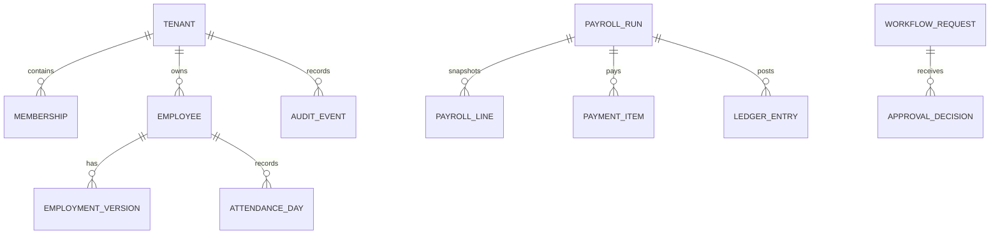

# PART 10 — Database Architecture

**الحالة:** تصميم منطقي ومادي مبدئي قابل للتحويل إلى migrations واختبارات contract؛ لا يفعّل أي migration تلقائيًا.  
**تاريخ الإصدار:** 8 سبتمبر 2026  
**المرجع:** PART 3، PART 4، PART 7، PART 9، migrations الحالية داخل `supabase/migrations`.

هذا الجزء يحول المنتج إلى قاعدة بيانات HR مؤسسية تحفظ التاريخ المالي والزمني، تعزل كل منشأة، وتسمح بالتوسع دون كسر الجداول القديمة. يصف أيضًا الفجوة الحالية: المشروع يستخدم Supabase/PostgreSQL ويملك جداول تشغيلية كثيرة، لكن عددًا من الجداول القديمة يعتمد على `company_id` أو لا يحمل tenant key صريحًا. لذلك يكون التنفيذ على مراحل انتقالية قابلة للمراجعة.

## 1. القرارات الأساسية

| القرار          | الاختيار                                     | السبب والحد                                                                                   |
| --------------- | -------------------------------------------- | --------------------------------------------------------------------------------------------- |
| محرك البيانات   | PostgreSQL عبر Supabase                      | معاملات وقيود وRLS وJSONB عند الحاجة؛ مناسب للـledger والتقارير                               |
| استراتيجية SaaS | Shared database + shared schema + tenant key | أقل كلفة تشغيلية ويستفيد من RLS؛ يظل فصل عميل واحد/DB ممكنًا للعملاء ذوي العزل التنظيمي الخاص |
| المفتاح القياسي | `tenant_id uuid` على كل جدول أعمال           | يمنع query بلا نطاق ويتيح composite FK/index؛ `company_id` يبقى alias انتقاليا                |
| هوية المستخدم   | `auth.users` مع profiles/tenant_memberships  | لا نكرر كلمات المرور أو أسرار الهوية في public schema                                         |
| المبالغ         | `numeric(19,4)` + `currency_code char(3)`    | لا floating point في الرواتب أو الضرائب أو المطابقة                                           |
| الوقت           | UTC في التخزين + timezone المؤسسة في العرض   | يحافظ على البصمة عبر التوقيت الصيفي ويمنع خلط تاريخ payroll                                   |
| التاريخ المالي  | snapshots وledgers immutable                 | إعادة الحساب تصنع version أو adjustment؛ لا تعديل صامت لسند مقفول                             |
| حذف الأعمال     | soft delete/archival، وRESTRICT للأثر المالي | لا يحذف employee أو payroll إذا كان له أثر محاسبي أو تدقيق                                    |
| التعريف العام   | UUID v4/7 غير قابل للتخمين من الواجهة        | يمنع enumeration؛ أرقام المرجع البشرية منفصلة وفريدة داخل tenant                              |
| تشغيل الوظائف   | جداول jobs/outbox مع worker idempotent       | لا تعتمد المعاملة على إرسال email أو webhook داخل request                                     |

اختيار shared schema صحيح للـMVP وبدايات النمو ما دام tenant guard وRLS وفحوص cross-tenant جزءًا من كل migration. عند بلوغ عميل متطلبات عزل أو residency خاصة، يُنقل tenant عبر نفس contracts إلى database منفصلة دون تغيير معرفات الأعمال.

## 2. الحالة الحالية والفجوة

الجداول الموجودة في المشروع تشمل `companies`, `subsidiaries`, `departments`, `employees`, `profiles`, `requests`, `user_roles`, `shifts`, `schedule_assignments`, `punches`, `attendance_records`, `leave_balances`, `payroll_groups`, `payroll_runs`, `payroll_details`, `salary_profiles`, `salary_advances`, `loans`, `settlements`, `expense_claims`, `expense_reports`, `performance_cycles`, `evaluation_records`, `job_openings`, `candidates`, `job_offers`, `asset_assignments`, `accounting_journals`, `payroll_payments`, و`audit_events`، إضافة إلى جداول الأجهزة والتكاملات والإشعارات.

الفجوات التي يجب إغلاقها قبل تشغيل SaaS متعدد العملاء:

- بعض الجداول القديمة لا تحمل `tenant_id`؛ الوصول يعتمد على join أو role فقط، وهذا لا يكفي لعزل قاعدة مشتركة.
- `company_id` غير موحد الدلالة بين المؤسسة الأم والتابع، وبعض المفاتيح الفريدة global بدل `(tenant_id, code)`.
- `payroll_details` و`payroll_runs` تحمل أرقامًا تشغيلية، لكن لا يوجد ledger مكونات مستقل يحافظ على مصدر كل خصم وإضافة.
- `accounting_journals.lines` JSONB مفيد كـsnapshot، لكنه يحتاج `journal_lines` مفهرسة للمطابقة والتقارير.
- `audit_events` و`request_timeline` يجب أن يكونا append-only مع actor/tenant/correlation/policy version.
- ملفات الموظفين والرواتب تحتاج file metadata وretention وencryption classification، وليس public URL فقط.
- soft delete وversion وeffective dates غير متسقة بين employee وsalary وpolicy.

لا تُحل هذه الفجوات بترحيل واحد كبير. الخطة في القسم 11 تضيف المفاتيح والقيود تدريجيًا وتبقي التطبيق القديم يعمل عبر views أو backfill مؤقت.

## 3. هرم البيانات والعلاقات



الـdiagram يوضح الملكية، وليس كل علاقة مرجعية. المفتاح الأهم هو أن payroll line وpayment item وledger entry تحفظ snapshot لمصدرها؛ لا تعتمد على قراءة employee الحالي بعد مرور الفترة.

## 4. المجموعات المنطقية

### 4.1 المؤسسة والهوية والصلاحيات

- `tenants`: معرف العميل، legal name، brand، status، plan، data residency.
- `tenant_settings`: timezone، locale، currency، calendar، numbering، retention، payroll country.
- `tenant_domains`: domain verification وSSO/SCIM mapping.
- `subsidiaries`, `departments`, `cost_centers`, `job_positions`, `work_locations`: الهيكل المؤسسي مع effective dates.
- `profiles`: اسم العرض واللغة والصورة؛ لا يحمل salary أو national ID.
- `tenant_memberships` (الاسم المنطقي السابق `memberships`): علاقة auth user بالtenant والدور والحالة وتاريخ البداية/النهاية.
- `role_definitions`, `permission_definitions`, `role_permissions`, `membership_roles`, `delegations`: catalog قابل للتوسع، مع policy version.

### 4.2 الموظف وملف العمل

- `employees`: public employee key، profile link، employee number، org links، status.
- `employment_versions`: عقد وmanager وposition وcost center وeffective range؛ لا نعدل الصف السابق بعد استخدامه.
- `employee_documents` و`employee_document_versions`: metadata وhash وstorage key وexpiry وvisibility.
- `salary_profiles`: basic/allowances وbank reference وeffective range؛ bank details في vault أو encrypted columns.
- `employee_consents`: موافقات الخصوصية والتوقيع والاحتفاظ، versioned.

### 4.3 الوقت والحضور

- `calendars`, `holidays`, `shift_definitions`, `schedule_assignments`.
- `attendance_devices`, `attendance_import_batches`, `attendance_import_rows` لحفظ المصدر وreject reason.
- `punches` للنبض الخام immutable؛ `attendance_days` projection يومية؛ `attendance_adjustments` تصحيح مع reason/evidence.
- `overtime_requests` و`attendance_policy_versions` لحساب الإضافي والتأخير والخروج المبكر.

### 4.4 الإجازات

- `leave_types`, `leave_policy_versions`, `leave_balances` (projection)، `leave_ledger` (source of truth)، `leave_requests`.
- حجز الرصيد يكتب reservation ledger، والاعتماد يرحله إلى used؛ الإلغاء قيد عكسي، ولا تنقص قيمة balance مباشرة بلا ledger.

### 4.5 الرواتب والسلف والدفع

- `payroll_groups`, `payroll_periods`, `payroll_runs`, `payroll_run_inputs`, `payroll_lines`.
- `payroll_components` و`payroll_line_components` لمصدر كل earning/deduction/tax/benefit؛ amount وrule version وsource reference.
- `salary_advances`, `loans`, `installment_schedules`, `deduction_ledger`.
- `payment_batches`, `payment_items`, `provider_callbacks`, `reconciliation_items`, `payslip_artifacts`.
- `settlement_cases`, `settlement_versions`, `settlement_items` للمخالصة؛ كل version يربط payroll/leave/asset/loan sources.

### 4.6 المصروفات والدفتر

- `expense_reports`, `expense_claims`, `expense_receipts`, `early_payout_requests`.
- `accounting_journals`, `journal_lines`, `reconciliation_runs`, `reconciliation_items`؛ JSON snapshot إن احتاج التكامل لا يلغي الخطوط المفهرسة.

### 4.7 التشغيل العام

- `workflow_requests`, `approval_chains`, `approval_steps`, `approval_decisions`, `request_timeline`.
- `jobs`, `job_attempts`, `outbox_events`, `inbox_dedup`, `notifications`, `notification_deliveries`.
- `audit_events`, `security_events`, `data_exports`, `report_definitions`, `report_runs`.
- `integration_connections`, `integration_sync_runs`, `webhooks`, `api_keys` (hash فقط)، `support_tickets`.
- `plans`, `subscriptions`, `entitlements`, `invoices`, `payment_methods` تحت نطاق commerce منفصل عن HR tenant data.

## 5. قواعد الأعمدة والقيود

### المفاتيح والفهارس

- كل جدول tenant-scoped يحتوي `id uuid primary key` و`tenant_id uuid not null` و`created_at`, `updated_at`, `created_by`, `updated_by` حسب طبيعة السجل.
- كل unique business key يسبق بـtenant: `(tenant_id, code)`, `(tenant_id, employee_number)`, `(tenant_id, reference_no)`.
- كل effective-dated table يفرض `valid_from < valid_to` أو `valid_to is null`، ويمنع overlap عبر exclusion constraint عندما يلزم.
- حالات الأعمال `text` أو enum versioned؛ لا تسمح PostgreSQL enum الجامد بتعطيل migration، ويُراجع status transition في command.
- `numeric` للمبالغ والساعات الحساسة؛ لا `float`; النسب لها scale واضح.
- jsonb للـmetadata أو snapshot غير الاستعلامي؛ الحقول التي تُفلتر أو تُطابق تصبح أعمدة typed.
- `version integer not null default 1` للصفوف القابلة للتعديل؛ update يشترط version الحالي.

### العلاقات والحذف

- `tenant_id` يكرر في child tables حتى يمكن فرض composite FK `(tenant_id, parent_id)` ومنع cross-tenant reference.
- master data غير المستخدم يمكن `archived_at`; employee وpayroll وjournal وaudit تستخدم RESTRICT.
- لا تستخدم `ON DELETE CASCADE` على سجلات مالية أو تدقيق؛ cascade مسموح فقط لبيانات import المؤقتة وnotifications غير الحساسة بعد retention.
- storage object لا يحذف بمجرد حذف metadata؛ يمر عبر retention job وlegal hold.

### الحساسية

| التصنيف      | أمثلة                                                    | التخزين والعرض                               |
| ------------ | -------------------------------------------------------- | -------------------------------------------- |
| public       | اسم المنتج، وصف الخطة                                    | plain، قابل للترجمة                          |
| internal     | department، shift، KPI مجمع                              | RLS وظيفي، لا public URL                     |
| confidential | salary، bank reference، performance notes                | encrypted/field allowlist، masked افتراضيًا  |
| restricted   | national ID، medical، investigation، support break-glass | vault أو encrypted، reason وaudit لكل reveal |

لا تخزن IBAN أو token مزود الدفع في logs أو notification payload. `*_hash` يستخدم لاكتشاف duplicate receipt أو API key دون إعادة السر.

## 6. Ledger ومصدر الحقيقة

يُفصل بين projection السريع وsource of truth:

- **Attendance:** `punches` مصدر خام؛ `attendance_days` projection قابلة لإعادة البناء؛ `attendance_adjustments` أوامر موثقة.
- **Leave:** `leave_ledger` المصدر؛ `leave_balances` projection، مع reservation/consume/release entries.
- **Payroll:** `payroll_run_inputs` snapshot ثم `payroll_line_components`; totals في run مشتقة ومتحقق منها.
- **Loans/advances:** `deduction_ledger` يثبت principal/disbursement/installment/waiver/settlement.
- **Accounting:** journal header + balanced `journal_lines`; debit = credit بقيد database وservice validation.
- **Payments:** provider callback لا يعدل payroll مباشرة؛ يحول إلى `payment_items` ثم reconciliation.

كل entry يحمل `source_type`, `source_id`, `effective_date`, `posted_at`, `currency`, `amount`, `rule_version`, `created_by`, و`reversal_of` عند التعويض. لا يوجد hard delete؛ التصحيح عكس قيد أو version جديد.

## 7. الفهارس المقترحة

- `(tenant_id, status, updated_at desc)` على employee، requests، jobs، tickets.
- `(tenant_id, employee_id, work_date)` unique على schedule وattendance day، و`(tenant_id, employee_id, punch_time)` على punches.
- `(tenant_id, period_id, status)` على payroll runs، و`(tenant_id, payroll_run_id, employee_id)` unique على payroll lines.
- `(tenant_id, employee_id, effective_from desc)` على employment/salary versions.
- `(tenant_id, source_type, source_id)` و`(tenant_id, event_type, created_at)` على ledger/outbox/audit.
- partial index للـ`status in pending/processing` في jobs وworkflow requests.
- GIN فقط على JSONB الذي يملك query contract؛ لا نضع GIN عشوائيًا على metadata.
- BRIN على punch/audit/event timestamps عند الحجم الكبير؛ partition زمنيًا حسب tenant tier بعد قياس فعلي.

كل index يبرر نفسه بـquery أو RLS policy. نراجع `EXPLAIN (ANALYZE, BUFFERS)` في staging قبل إضافته للإنتاج.

## 8. RLS ونطاق tenant

الدالة المرجعية تكون `current_user_tenant_ids()` من membership الفعال و`current_tenant_id()` من session context الموثوق. السياسة الأساسية:

```sql
using (tenant_id = any (public.current_user_tenant_ids()))
with check (tenant_id = public.current_tenant_id());
```

ثم تضاف سياسات scope للموظف والمدير والمالية فوق tenant guard. لا تستخدم `USING (true)` على جدول tenant حتى لو كانت الواجهة تخفي الصفوف. service role لا يستخدم في browser؛ edge/server function يحقق actor وtenant وreason قبل استخدامه. أي `SECURITY DEFINER` يثبت `search_path = public` ويفتح أقل صلاحية ممكنة.

التقارير متعددة المستأجرين للمنصة لا تقرأ الجداول مباشرة من tenant session؛ تستخدم aggregate tables أو وظيفة platform ذات allowlist وaudit. لا تجمع salary raw في product analytics.

## 9. المعاملات والتزامن

- command قصير: validate → lock relevant row → write aggregate/ledger/outbox → commit.
- لا ننتظر provider أو email داخل transaction؛ job منفصل مع timeout وquery-before-retry.
- payroll lock يستخدم `select for update` وrun version؛ concurrent calculate يرجع conflict لا يكتب فوق snapshot.
- leave reservation وsalary deduction وpayment preparation تستخدم RPC/transaction واحدة، وتتحقق من available balance تحت lock.
- bulk import يعمل batches صغيرة مع `import_batch_id`، ويعزل reject rows؛ لا transaction عملاقة تحجز قاعدة البيانات.
- event consumer يستخدم inbox dedup وlast processed cursor؛ out-of-order events ترفض أو تعاد إلى queue وفق version.

## 10. الاحتفاظ والنسخ الاحتياطي

- audit، payroll snapshot، journal، payment reconciliation: retention يحدده البلد والعقد، مع legal hold؛ لا حذف تلقائي قبل موافقة.
- punch الخام وjob logs يحتفظان بفترة تشغيلية ثم archive بارد، مع hash للتحقق.
- documents تستخدم storage lifecycle وvirus scan وsigned URLs قصيرة.
- backup يومي مشفر + PITR واختبار restore دوري؛ RPO مبدئي 15 دقيقة وRTO مبدئي 4 ساعات، ويُراجعان حسب الخطة.
- tenant export يصدر JSON/CSV/PDF مع manifest وchecksum؛ الاستيراد يعيد mapping ولا يكتب فوق tenant حي.

## 11. خطة الترحيل من schema الحالي

1. **Inventory:** تثبيت snapshot للجداول والـFK والسياسات والـunique الموجودة؛ يمنع migration تخمينًا.
2. **Tenant registry:** إنشاء `tenants` و`tenant_legacy_map`، وربط كل `companies.id` بtenant واحد؛ لا نغير UUID.
3. **Membership context:** إضافة membership فعالة ودوال tenant guard، ثم اختبارات RLS cross-tenant.
4. **Nullable backfill:** إضافة `tenant_id` nullable إلى الجداول tenant-scoped، تعبئته عبر company/employee/parent، وتسجيل الصفوف غير القابلة للربط في remediation table.
5. **Composite integrity:** إضافة `(tenant_id,id)` unique وcomposite FKs والفهارس؛ إصلاح business unique من global إلى tenant-scoped بعد فحص duplicates.
6. **Not-null gate:** منع إدخالات بلا tenant في server/RPC، ثم تحويل `tenant_id` إلى NOT NULL في دفعة منفصلة بعد صفر orphan rows.
7. **Canonical aliases:** view أو column compatibility لـ`company_id`، ثم تحديث repositories وtypes واختبارات contract تدريجيًا.
8. **Ledger and audit:** إنشاء journal_lines وleave_ledger وdeduction_ledger وoutbox/inbox وappend-only audit، ثم redirect projections.
9. **Retire legacy path:** بعد دورة payroll ناجحة وrestore drill، يُوقف المسار القديم خلف feature flag؛ لا نحذف migration التاريخية.

كل migration يملك preflight SQL وpostflight assertions وrollback/recovery note. لا يمر migration يضيف NOT NULL أو RLS قبل تقرير orphan وcross-tenant.

## 12. معايير القبول

1. **DB-A01:** أي SELECT من user في tenant A لا يعيد صفًا من tenant B حتى مع معرف معروف.
2. **DB-A02:** insert/update بلا tenant context يفشل برسالة موحدة ولا يستخدم default tenant.
3. **DB-A03:** `(tenant_id, code)` يسمح بنفس كود shift في مؤسستين ويمنع تكراره داخل واحدة.
4. **DB-A04:** كل employee مربوط بـtenant عبر company/organization mapping، ولا orphan بعد backfill.
5. **DB-A05:** salary profile الجديد لا يلغي النسخة السابقة؛ effective ranges لا تتداخل.
6. **DB-A06:** payroll lock يمنع تعديل payroll line ويقبل adjustment version فقط.
7. **DB-A07:** مجموع journal lines debit يساوي credit قبل post؛ mismatch يرفض المعاملة.
8. **DB-A08:** leave cancellation يضيف reverse ledger ولا يغير entry القديم.
9. **DB-A09:** duplicate device punch بنفس source key لا يضاعف attendance hours.
10. **DB-A10:** payment callback المكرر لا ينشئ payment item ثانيًا.
11. **DB-A11:** audit event append-only؛ update/delete من authenticated مرفوض.
12. **DB-A12:** reveal لحقل restricted يتطلب permission وreason ويسجل event.
13. **DB-A13:** soft-deleted employee لا يظهر في active list، ويظل payroll/audit relation قابلًا للقراءة المصرح بها.
14. **DB-A14:** concurrent leave reservation تحت lock لا يسمح برصيد سالب.
15. **DB-A15:** job retry لا يرسل email أو webhook أكثر من مرة لنفس event id.
16. **DB-A16:** report export يحفظ filter snapshot وtenant والـas_of ولا يقرأ تغييرات لاحقة.
17. **DB-A17:** restore إلى PITR يعيد outbox وledger وaudit متسقة أو يعلن نقطة عدم اتساق.
18. **DB-A18:** migration preflight يوقف العملية إذا وجدت tenant_id orphan أو duplicate business key.
19. **DB-A19:** partition/archive لا يكسر FK أو query شاشة attendance وفق retention.
20. **DB-A20:** platform aggregate لا يعرض salary raw ولا يسمح بتمرير tenant_id حر من المتصفح.

## 13. تسليم التنفيذ

يبدأ التنفيذ بإنشاء tenant registry وmembership context ثم backfill/fk guard، وبعده ledger/outbox وversioned payroll. يترجم فريق backend الكتالوج الآلي إلى SQL migrations صغيرة، وفريق data يكتب reconciliation queries، وفريق QA يثبت DB-A01–20 على Supabase test project. يبقى country payroll schema ومدة الاحتفاظ والـresidency قرارات مفتوحة حتى تثبيت الأسواق والعقود؛ لا يُخفى ذلك داخل migration افتراضية.
