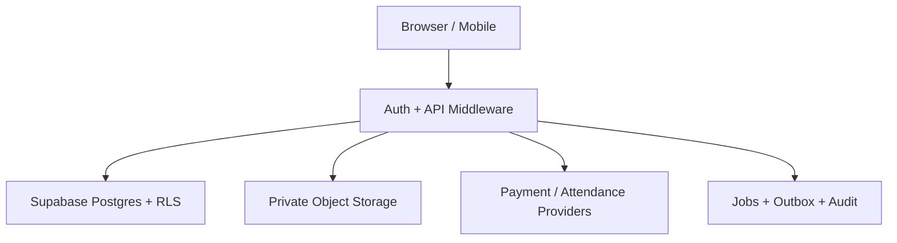

# PART 12 — Security Architecture

**الحالة:** Threat Model وضوابط أمنية مبدئية قابلة للتحويل إلى سياسات وtests؛ لا تمنح اعتمادًا أمنيًا أو شهادة امتثال.  
**تاريخ الإصدار:** 8 سبتمبر 2026  
**المرجع:** PART 4، PART 9، PART 10، PART 11، migrations الأمنية، و`src/integrations/supabase`.

المنتج يعالج رواتب وهوية وحضورًا وملفات موظفين؛ لذلك الأمن شرط صلاحية تجارية، وليس طبقة لاحقة. يوضح هذا الجزء ما هو موجود في المستودع وما يجب سدّه قبل pilot أو production.

## 1. الأصول وحدود الثقة

### الأصول الحرجة

- salary profiles، payroll snapshots، deductions، bank references، payment callbacks.
- national ID/Iqama، documents، medical أو investigation notes، performance feedback.
- tenant membership وroles وapproval chains وaudit history.
- service-role key، provider credentials، webhook secrets، signed file URLs.
- availability والـqueue والنسخ الاحتياطية، لأن توقف payroll له أثر مالي وتشغيلي.

### حدود الثقة

المتصفح وdevice وprovider مصادر غير موثوقة. server middleware يتحقق من الهوية، domain services تتحقق من business policy، وPostgres RLS يفرض آخر حد للـtenant. `service_role` يتجاوز RLS، لذلك لا يُستخدم إلا داخل server-side operation محددة ومراجعة.

## 2. نموذج التهديد

| التهديد                              | الأثر                           | الاحتمال قبل الضوابط | الضوابط المطلوبة                                                      |
| ------------------------------------ | ------------------------------- | -------------------- | --------------------------------------------------------------------- |
| IDOR/cross-tenant عبر UUID أو filter | كشف أو تعديل رواتب عميل آخر     | عالٍ                 | tenant context + composite FK + RLS + API scope tests                 |
| تصعيد employee إلى HR/finance        | تغيير role أو اعتماد راتب       | متوسط                | role catalog server-side، SoD، MFA للأفعال الحساسة، audit             |
| تسريب token أو service key           | قراءة/تغيير شامل                | عالٍ                 | secrets manager، عدم bundle، rotation، egress alerts                  |
| replay/spoof لـwebhook أو punch      | دفع مكرر أو ساعات مزيفة         | متوسط                | HMAC، timestamp، provider event id، device key، dedup                 |
| race في leave/payroll/payment        | رصيد سالب أو صرف مزدوج          | متوسط                | DB locks، idempotency، version، reconciliation                        |
| ملف ضار أو public URL                | XSS، malware، تسريب مستند       | متوسط                | signed upload، MIME+magic check، AV scan، private bucket              |
| حقن SQL أو query filter              | قراءة/تعديل غير مقصود           | متوسط                | typed schemas وallowlist وعدم concatenation وRLS                      |
| XSS/HTML/CSV formula injection       | تنفيذ في browser أو spreadsheet | متوسط                | escaping، CSP، sanitization، prefix export cells                      |
| SSRF من integration URL              | وصول شبكة داخلية                | منخفض/متوسط          | egress allowlist، DNS/IP validation، timeout، no redirects غير موثوقة |
| insider/break-glass إساءة استخدام    | كشف restricted data             | منخفض/متوسط          | سبب ومدة وموافق ثانٍ، read audit، alert، review                       |
| denial of service/queue flood        | تعطيل ESS أو payroll            | متوسط                | rate limits، quotas، backpressure، circuit breaker                    |
| backup أو log يحتوي PII              | أثر واسع عند التسريب            | متوسط                | encryption، redaction، retention، access review                       |

## 3. المصادقة وإدارة الجلسة

- Supabase Auth/OIDC هو مصدر الهوية؛ كلمات المرور لا تمر إلى public schema ولا تُخزن في التطبيق.
- MFA مطلوب للـorg_owner وpayroll/finance approvals، ولتغيير bank/provider credentials وbreak-glass. WebAuthn أو TOTP مع recovery codes one-time.
- access token قصير العمر، refresh rotation، إبطال الجلسات عند تغيير role أو reset أو incident. لا نضع token في URL أو logs.
- middleware يرفض غياب Bearer أو token غير صالح ويحول الأخطاء إلى 401 موحد؛ لا يعتمد على فحص dot count وحده، بل signature/claims/audience/issuer/expiry في Auth provider.
- device credentials منفصلة عن user sessions، قابلة للrotation/revoke، scope لجهاز وموقع وفترة.
- CSRF: bearer API بلا cookie لا يحتاج CSRF token؛ أي browser cookie/session مستقبلية تستخدم SameSite=Lax/Strict وOrigin check وanti-CSRF token.
- password reset/email verification/OTP لها rate limit، single-use token، ورسالة لا تكشف وجود البريد.
- tenant switch لا يغير claim تلقائيًا؛ server يتحقق من membership الفعال ويصدر context مقيدًا.

## 4. Authorization وRLS

- RBAC catalog من PART 4 هو baseline، ويضاف ABAC: tenant، subsidiary/department/team، employee self، effective date، status.
- default deny: لا role أو permission جديد يعمل لمجرد إدخاله في client storage أو localStorage.
- self-approval مرفوض؛ maker/checker للدفع والرواتب؛ auditor read-only؛ support لا يرى payroll raw.
- كل جدول أعمال tenant-scoped يحمل `tenant_id` وRLS guard قبل role predicates. policies لا تستخدم `USING (true)` في production.
- server functions تستدعي `requireSupabaseAuth` ثم `assertRole`/policy service؛ service-role RPC يحتاج tenant/user/reason صريحًا، ويفضل إنشاء schema private لا exposed.
- field-level allowlist: salary/bank/national ID/performance/restricted لا يخرج في projection عامة حتى لو كان الصف مسموحًا.
- صلاحيات مؤقتة: delegation بوقت نهاية، وbreak-glass بمدة وموافقة وأثر قراءة لكل record.

## 5. حماية البيانات والأسرار

- TLS 1.2+ بين browser/API/provider؛ HSTS وsecure headers في edge.
- at-rest encryption من Supabase/storage/provider، وfield encryption أو vault للـIBAN والهوية والprovider config. مفاتيح التشفير خارج DB، مع KMS rotation.
- service-role key وwebhook secret وAPI key في secrets manager/CI secrets، لا في repo أو `.env` committed أو client bundle. فحص secret في pre-commit وCI.
- لا تُطبع authorization، cookies، salary، national ID، payload payment، أو document URL في logs. `request_id` وhash identifiers للتتبع.
- database roles أقل صلاحية: anon بلا table grants، authenticated عبر RLS، worker role للـqueue، service role محدود للمهام التي تحتاجه.
- backups مشفرة مع access review وPITR وrestore drill؛ legal hold يوقف deletion.

## 6. API وwebhook security

- كل endpoint من PART 11 يطبق auth → tenant → permission → validation → state transition؛ الترتيب لا يعكسه client.
- idempotency key وIf-Match للأوامر؛ rate limiting per user/tenant/device/IP مع quotas للخطة.
- filter/sort/include من allowlist؛ لا SQL fragments أو arbitrary `select` من query string.
- errors لا تفرق بين «غير موجود» و«غير مرئي» لبيانات restricted؛ code ثابت وrequest_id.
- webhooks تتحقق HMAC على body الخام وtimestamp/nonce، وتستعمل provider event id unique؛ تضع الحدث في quarantine ثم job.
- outbound webhook signatures، destination allowlist، secret rotation، exponential backoff، DLQ، ووقف تلقائي بعد failures.
- payment callback لا يغير `paid` قبل provider reconciliation؛ timeout يستعلم provider قبل retry.

## 7. أمن الملفات والواجهة

- upload يبدأ signed session محدودًا بالtenant/entity/size/expiry؛ المتصفح لا يختار bucket path حرًا.
- فحص extension وMIME وmagic bytes والحجم، منع double extension وSVG/HTML النشط، AV/CDR للـPDF/Office، وquarantine قبل publication.
- objects private؛ download signed URL قصير بعد permission check؛ revoke عند حذف أو انتهاء access.
- أسماء الملفات sanitised؛ path traversal وzip bombs وmacro files مرفوضة حسب policy.
- React escaping وCSP تمنع inline script؛ أي HTML مترجم أو chart tooltip sanitized. `dangerouslySetInnerHTML` يقتصر على CSS/config موثوق بعد مراجعة.
- export Excel يهرب cells التي تبدأ `=`, `+`, `-`, `@` لمنع formula injection، وPDF لا يضمن أن النص المالي غير مقنع.
- localStorage لا يحتفظ ببيانات payroll أو permission decisions؛ المخزن الحالي للـpreview وUI overrides يجب أن يظل غير مصدر حقيقة ويُزال في production mode.

## 8. OWASP controls

| OWASP area                   | تطبيق المنتج                                 | دليل/اختبار                   |
| ---------------------------- | -------------------------------------------- | ----------------------------- |
| Broken Access Control        | RLS + tenant guard + ABAC/SoD                | SEC-A01–06 وcross-tenant test |
| Cryptographic Failures       | TLS، KMS، field encryption، redacted logs    | key rotation وlog scan        |
| Injection                    | Zod/typed input، query allowlist، escaping   | fuzz/API negative tests       |
| Insecure Design              | state machines، ledger، approval contract    | WF/DB/API acceptance          |
| Security Misconfiguration    | headers، anon revoke، env checks             | config lint وdeployment scan  |
| Vulnerable Components        | lockfile، Dependabot/SCA، patch SLA          | CI audit                      |
| Identification/Auth Failures | MFA، rotation، rate limits، token validation | auth abuse tests              |
| Software/Data Integrity      | signed webhook، artifact hash، protected CI  | replay/tamper tests           |
| Logging/Monitoring Failures  | audit/security events، correlation، alerts   | incident drill                |
| SSRF                         | provider allowlist وegress controls          | URL/IP test                   |

## 9. المراقبة والاستجابة

- security events: failed login/MFA، role change، restricted reveal، export، break-glass، webhook failure، RLS deny، key rotation، backup restore.
- alert thresholds: repeated 401/403، cross-tenant denial، unusual salary export، provider callback mismatch، DLQ growth، break-glass خارج ساعات العمل.
- incident severity: P0 data/payment exposure، P1 payroll availability، P2 tenant feature، P3 single user. كل incident له owner وtimeline وcontainment وevidence وpostmortem.
- عند الاشتباه: revoke sessions/keys، quarantine webhook/provider، freeze payment batch، preserve audit/log/legal hold، ثم communicate وفق SLA والعقد.
- access review ربع سنوي للأدوار والدعم، ومراجعة service accounts قبل انتهاء expiry.

## 10. Secure delivery وDevSecOps

- branch protection، required review، CODEOWNERS للـmigrations وauth/payment، وsecret scanning.
- CI: typecheck/lint/test، dependency/SCA، Semgrep أو equivalent، IaC/config scan، OpenAPI/RLS contract، container scan، وSBOM.
- staging ببيانات synthetic أو masked؛ لا تنسخ production salary/documents إلى preview.
- migrations forward-only مع preflight/postflight وrollback recovery؛ لا force push أو secret في commit.
- release يحتاج security checklist وthreat-model delta عندما يضاف integration أو restricted field.

## 11. معايير قبول أمنية

1. **SEC-A01:** UUID من tenant A لا يعيد employee/payroll من tenant B.
2. **SEC-A02:** تعديل role عبر localStorage أو body لا يرفع صلاحية server.
3. **SEC-A03:** membership منتهية أو suspended تعيد 403 ولا تنشئ audit business effect.
4. **SEC-A04:** self-approval وmaker/checker violation مرفوضان في API وRPC.
5. **SEC-A05:** restricted salary reveal يسجل actor/reason/field/entity/IP hash.
6. **SEC-A06:** support break-glass ينتهي تلقائيًا ويرسل security alert.
7. **SEC-A07:** service-role key لا يظهر في client bundle أو logs أو repository.
8. **SEC-A08:** middleware يتحقق issuer/audience/expiry/signature ولا يعتمد على شكل JWT فقط.
9. **SEC-A09:** MFA مطلوب لتأكيد payment/bank change/role escalation حسب policy.
10. **SEC-A10:** إعادة webhook أو punch بنفس provider/event/source key لا تضاعف الأثر.
11. **SEC-A11:** توقيع/nonce/time خارج النافذة يدخل quarantine ولا يغير database.
12. **SEC-A12:** upload لملف HTML/SVG/zip bomb أو MIME متضارب يُرفض أو يعزل.
13. **SEC-A13:** signed URL منتهي أو tenant مختلف لا ينزل document.
14. **SEC-A14:** filter/sort injection يرجع 422 ولا ينفذ SQL fragment.
15. **SEC-A15:** CSV export يهّرب formula cells ويفرض field allowlist.
16. **SEC-A16:** CSP/security headers موجودة في production response؛ XSS probe لا ينفذ.
17. **SEC-A17:** rate limit وaccount lockout يحدان brute force ويتركان alertًا.
18. **SEC-A18:** backup وlogs لا يحتويان raw salary/IBAN/national ID في scan دوري.
19. **SEC-A19:** restore drill يعيد tenant/RLS/audit متسقة ونقطة RPO معلنة.
20. **SEC-A20:** dependency CVE فوق SLA أو secret scan يفشل CI ولا يسمح release.

## 12. فجوات التنفيذ الحالية وتسليمها

المستودع يملك `requireSupabaseAuth` وRLS وسياسات grants وserver-only admin client، وهي أساس جيد. يحتاج قبل pilot إلى tenant guard موحد (الـmigrations الحالية خليط من company scope وglobal policies)، field encryption/vault، signed private document flow، MFA للأفعال الحساسة، webhook verification، security headers/CSP، وإزالة أي اعتماد تشغيلي على localStorage permission overrides. يترجم فريق الأمن SEC-A01–20 إلى tests وrunbooks، ويثبت فريق backend أقل صلاحية لـservice role، ثم يعاد تقييم threat model عند كل integration أو country payroll rule.

يبقى اعتماد الخصوصية، data residency، retention، وDPA قرارًا تجاريًا/قانونيًا لكل سوق؛ لا ندعي امتثال ISO أو SOC أو قانون محلي من وجود هذه المواصفات وحدها.
