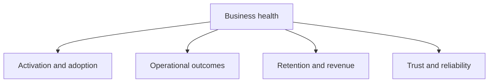

# PART 15 — Product & Business Analytics

**الحالة:** taxonomy ومقاييس ولوحات مبدئية قابلة للتنفيذ؛ لا تُرسل أحداثًا جديدة تلقائيًا.  
**تاريخ الإصدار:** 8 سبتمبر 2026  
**المرجع:** PART 2، PART 5، PART 9، PART 12، PART 13، PART 14.

التحليلات هنا تساعد فريق المنتج والعميل على معرفة هل تم تفعيل المنشأة، وهل تقل أخطاء الحضور والرواتب، وهل يستمر العميل ويدفع. لا نستخدم analytics لنسخ salary أو national ID أو ملاحظات الأداء؛ المقاييس المالية للمنصة مجمعة، وبيانات العميل التشغيلية تبقى داخل tenant scope.

## 1. أهداف القياس

1. **Activation:** هل انتقلت المنشأة من التسجيل إلى أول موظف، policy، attendance import، وpayroll preview؟
2. **Outcome:** هل انخفض وقت إغلاق الرواتب والخصومات اليدوية والاستثناءات؟
3. **Adoption:** هل تستخدم الأدوار الوحدات التي دفعت لها، أم بقيت الشاشة شكلية؟
4. **Reliability:** هل الطلبات والjobs والدفع والمطابقة تنجح ضمن SLA؟
5. **Retention/Revenue:** هل يعود المستخدم والـtenant، يتوسع seat/module، ويدفع في موعده؟
6. **Customer health:** هل الدعم وNPS وfeature requests تشير إلى خطر churn؟
7. **Safety:** هل يظهر وصول restricted أو export أو break-glass غير معتاد؟

## 2. شجرة المقاييس



- **Activation:** signup → verified → tenant configured → first employee → first workflow → first payroll preview.
- **Adoption:** WAU/MAU، feature penetration، approval completion، self-service success.
- **Outcomes:** payroll close time، attendance exception rate، leave balance accuracy، payment reconciliation age.
- **Retention/revenue:** logo retention، net revenue retention، expansion، churn، failed payment recovery.
- **Trust:** error rate، RLS denials، restricted exports، support SLA، incident count.

## 3. تعريفات المقاييس

| metric                    | التعريف والحساب                                                                | النافذة/التقسيم                            |
| ------------------------- | ------------------------------------------------------------------------------ | ------------------------------------------ |
| Activation rate           | tenants التي حققت 4 milestones / tenants verified                              | cohort أسبوع التسجيل، plan، country        |
| Time to first value       | first payroll preview − verified timestamp                                     | p50/p90، tenant size                       |
| WAU/MAU                   | users الفريدون الذين نفذوا event product.success / users الفريدين              | 7/30 يوم، role/locale                      |
| Module adoption           | tenants ذات successful command في module / active tenants                      | 28 يوم، plan                               |
| Approval SLA              | median(decided_at − submitted_at) مع استثناء returned وقت المُنشئ              | request type، tenant calendar              |
| Attendance exception rate | أيام بها late/absence/correction / أيام مجدولة                                 | period، shift، location                    |
| Payroll close time        | locked_at − calculation_started_at                                             | run، employee bucket، p50/p95              |
| Payroll error rate        | runs فاشلة أو exception غير محلولة / runs                                      | run/month، provider                        |
| Reconciliation age        | now − oldest unmatched payment item                                            | tenant، provider، severity                 |
| Leave balance accuracy    | balanced ledger projection checks / checks                                     | nightly، leave type                        |
| Self-service success      | commands completed / commands started في ESS                                   | device، role، locale                       |
| Logo retention            | tenants active في الشهر السابق والنشطين في الشهر الحالي / tenants الشهر السابق | monthly cohort                             |
| Gross revenue retention   | recurring revenue retained before expansion / starting recurring revenue       | plan/currency، بدون raw salary             |
| Net revenue retention     | (start − churn − contraction + expansion) / start                              | monthly/quarterly                          |
| Failed payment recovery   | subscriptions recovered within grace / failed subscriptions                    | plan/provider                              |
| Support SLA               | tickets within first-response/resolve target / closed tickets                  | priority/channel                           |
| NPS                       | %promoters − %detractors مع response count                                     | quarterly، plan، cohort                    |
| Customer health           | weighted usage/outcome/support/payment score                                   | tenant owner فقط، thresholds قابلة للتعديل |
| Data quality rate         | events valid schema and deduped / received events                              | source/version                             |

القيم المالية في platform analytics تكون currency-normalized أو local aggregates؛ لا نخلط SAR/USD دون exchange rate/as_of، ولا نعرض employee-level net pay في منصة analytics.

## 4. Event taxonomy

صيغة الاسم `domain.object.action` بأحرف صغيرة، والـevent immutable. أمثلة:

- `auth.login.succeeded`, `auth.mfa.completed`, `tenant.onboarding.completed`.
- `employee.created`, `employee.document.uploaded`, `employee.profile.viewed`.
- `attendance.punch.recorded`, `attendance.import.completed`, `attendance.correction.decided`.
- `leave.request.submitted`, `leave.request.decided`, `leave.balance.adjusted`.
- `payroll.run.calculation_completed`, `payroll.run.locked`, `payslip.viewed`.
- `advance.requested`, `expense.submitted`, `settlement.signed`.
- `payment.batch.submitted`, `payment.item.reconciled`, `integration.sync.failed`.
- `report.run.requested`, `report.run.completed`, `data.export.denied`.
- `support.ticket.created`, `support.ticket.resolved`, `security.break_glass.read`.

كل حدث يحمل:

```json
{
  "event_id": "evt_opaque",
  "event_name": "leave.request.submitted",
  "schema_version": "1.0",
  "occurred_at": "2026-09-08T12:00:00Z",
  "tenant_key": "tenant_hash",
  "actor_key": "user_hash",
  "actor_role": "employee",
  "surface": "web",
  "locale": "ar-SA",
  "properties": { "request_type": "annual", "days_bucket": "2_5" }
}
```

`tenant_key` و`actor_key` hash/stable pseudonymous. يمنع catalog أي `email`, `full_name`, `national_id`, `iban`, salary amount، document text، performance note، IP خام أو URL signed. amount يختزل bucket أو aggregate؛ السبب الحر يرسل code لا نصًا.

## 5. معمارية البيانات

1. SDK/command wrapper يضيف event_id وschema version وsurface وlocale ويطبق consent/allowlist.
2. collector server يتحقق schema وtenant context ويزيل PII، ثم يكتب event bus/outbox؛ browser لا يرسل warehouse credentials.
3. queue يفصل event ingestion عن request path، وdedup على event_id/source.
4. raw event store مشفر قصير retention؛ warehouse يحوي curated facts/dimensions وtenant scope.
5. metric jobs تبني daily aggregates وcohorts؛ dashboards تقرأ aggregate views، لا tables payroll.
6. deletion/export request يطبق user/tenant privacy policy ويترك aggregate غير القابل لإعادة التعرف حسب العقد.
7. lineage يربط metric بـevent schemas وquery version وas_of؛ كل تغيير يملك migration/backfill note.

للـMVP يمكن Supabase/Postgres + outbox وaggregate tables؛ عند نمو الحجم ينقل warehouse إلى ClickHouse/BigQuery/Snowflake عبر نفس event contract. لا نضيف microservice قبل queue/warehouse bottleneck مقاسًا.

## 6. لوحات الاستخدام

| اللوحة               | المستفيد           | المؤشرات والقيود                                                                           |
| -------------------- | ------------------ | ------------------------------------------------------------------------------------------ |
| Platform health      | product/CS/ops     | activation، retention، MRR/NRR، errors، queue، incidents؛ tenant aggregate                 |
| Organization cockpit | org_owner          | headcount، attendance exceptions، payroll status، leave utilization، SLA؛ نطاق tenant      |
| HR operations        | HR manager         | onboarding، documents expiry buckets، requests aging، turnover buckets                     |
| Attendance           | attendance officer | punch ingestion، late/early/absence، device sync health، corrections                       |
| Payroll/finance      | payroll/finance    | run progress، exception count، total buckets، payment/reconciliation age؛ restricted roles |
| Manager              | line manager       | team approvals، attendance summary، leave calendar، performance completion                 |
| Employee ESS         | employee           | own requests status، attendance days، payslip viewed، tasks؛ no peer data                  |
| Support/security     | support/security   | tickets/SLA، break-glass reads، RLS denies، webhook failures؛ least privilege              |

كل بطاقة تعرض period/as_of/source، freshness، sample size، وسبب unavailable. drill-down يحافظ على filter/tenant/role ولا يفتح restricted row من chart.

## 7. Funnels وcohorts

- onboarding funnel: landing → registration → verify → tenant setup → first employee → first attendance import → payroll preview.
- payroll funnel: run created → calculated → reviewed → locked → payment submitted → reconciled.
- leave funnel: draft → submitted → decided → calendar reflected → cancelled/complete.
- support funnel: created → first response → waiting customer → resolved → reopened.
- retention cohorts حسب verified week وplan/employee bucket/locale؛ لا cohort حسب اسم أو salary.
- feature adoption يستخدم successful outcome لا مجرد page view؛ page view مفيد UX فقط ولا يساوي value.

## 8. جودة البيانات والخصوصية

- schema registry يفرض required/optional/type/range/PII classification؛ invalid event إلى quarantine وmetric data_quality_rate.
- clock skew وduplicate/out-of-order events تعالج بـoccurred_at وreceived_at وevent_id وaggregate version.
- sampling معلن للأحداث عالية الحجم؛ payroll/payment/security لا تُsample عند الحاجة للتدقيق.
- access للـwarehouse RBAC/tenant row policies؛ analyst يرى aggregate، CS يرى tenant health، security يرى event metadata المقنع.
- retention: raw events أقصر، curated aggregates حسب العقد؛ deletion workflow موثق، وlegal hold يوقف purge.
- consent والـDPA: product analytics الأساسية للضرورة التشغيلية؛ أي behavioral tool اختياري خلف consent/config، وDo Not Track يُحترم حيث يلزم.
- لا تستخدم analytics لاتخاذ قرار توظيف/راتب آلي دون human review؛ score health ليس تقييمًا للموظف.

## 9. المقاييس المضادة والحواجز

- activation العالي مع payroll error أو support tickets عالٍ ليس نجاحًا؛ نعرض guardrails بجانب funnel.
- زيادة page views مع انخفاض successful command تعني confusion، لا adoption.
- NRR وMRR يعتمدان invoice/entitlement facts، لا قيمة الرواتب أو عدد الموظفين وحده.
- health score لا يعاقب tenant جديدًا قليل البيانات؛ minimum sample وconfidence label.
- لا نستخدم churn prediction لاتخاذ إيقاف تلقائي أو خفض صلاحيات؛ CS review مطلوب.

## 10. Instrumentation plan

| المرحلة            | الأحداث الأولى                                                                       | المالك           |
| ------------------ | ------------------------------------------------------------------------------------ | ---------------- |
| P0 auth/onboarding | login، verify، tenant setup، employee created، first value                           | product/platform |
| P0 core operations | attendance import/punch، leave decision، payroll calculate/lock، payment/reconcile   | domain owners    |
| P1 adoption        | dashboard action، approval inbox، payslip viewed، report completed، integration sync | product          |
| P1 trust           | error، retry، RLS deny، export denied، break-glass read                              | security/ops     |
| P2 growth          | invite accepted، plan change، invoice paid/failed، support/NPS                       | growth/CS        |

كل event في manifest قبل merge؛ wrapper يضيف `schema_version` ويمنع properties خارج allowlist. feature flags تربط instrumentation الجديدة بtenant internal أولًا.

## 11. معايير قبول Analytics

1. **AN-A01:** كل event يملك event_id وschema_version وoccurred_at وtenant/actor pseudonymous keys.
2. **AN-A02:** catalog يرفض email/name/national ID/IBAN/salary raw/document text/IP raw.
3. **AN-A03:** tenant context لا يأتي من property حرة؛ collector يثبت membership/RLS.
4. **AN-A04:** duplicate event_id لا يضاعف metric أو cohort.
5. **AN-A05:** out-of-order event لا يكسر daily aggregate أو payroll funnel.
6. **AN-A06:** invalid schema يذهب quarantine ويزيد data_quality error.
7. **AN-A07:** payroll/payment/security events لا تُsample بطريقة تضر التدقيق.
8. **AN-A08:** dashboard employee يعرض بياناته فقط ولا يعيد peer/salary raw.
9. **AN-A09:** platform dashboard يعرض aggregate بعد حد sample ولا يكشف tenant منخفض العينة.
10. **AN-A10:** كل metric يعرض definition/window/as_of/freshness/source.
11. **AN-A11:** currency normalization يعرض currency وexchange rate/as_of عند الجمع.
12. **AN-A12:** onboarding funnel يميز verified وfirst value ولا يحسب page view وحده.
13. **AN-A13:** payroll funnel يميز calculated/reviewed/locked/reconciled.
14. **AN-A14:** retention cohort لا يستخدم PII أو salary أو نص سبب حر.
15. **AN-A15:** export analytics يطبق role/tenant scope وsigned URL expiry.
16. **AN-A16:** deletion/DSAR workflow يطبق raw event retention/legal hold دون orphan identity.
17. **AN-A17:** access warehouse analyst/CS/security يطابق least privilege ويكتب audit.
18. **AN-A18:** health score يحمل confidence/minimum sample ولا يغير access أو payroll تلقائيًا.
19. **AN-A19:** instrumentation change يملك schema review/backfill note وfeature flag عند الحاجة.
20. **AN-A20:** data-quality/metric anomaly تنشئ alert ولا تمر بصمت إلى executive dashboard.

## 12. تسليم التنفيذ

يبدأ الفريق بـevent registry وserver collector وP0 instrumentation للتهيئة والحضور والرواتب، ثم aggregate views ولوحتي platform وorganization. يثبت QA AN-A01–20 مع schema/PII scan وdedup fixtures، ويضع product owners تعريفًا مكتوبًا لكل KPI. تبقى أداة warehouse وbehavioral analytics ومدة raw retention قرارات تكلفة/خصوصية، ولا تُحسم بإضافة SDK عشوائي.
