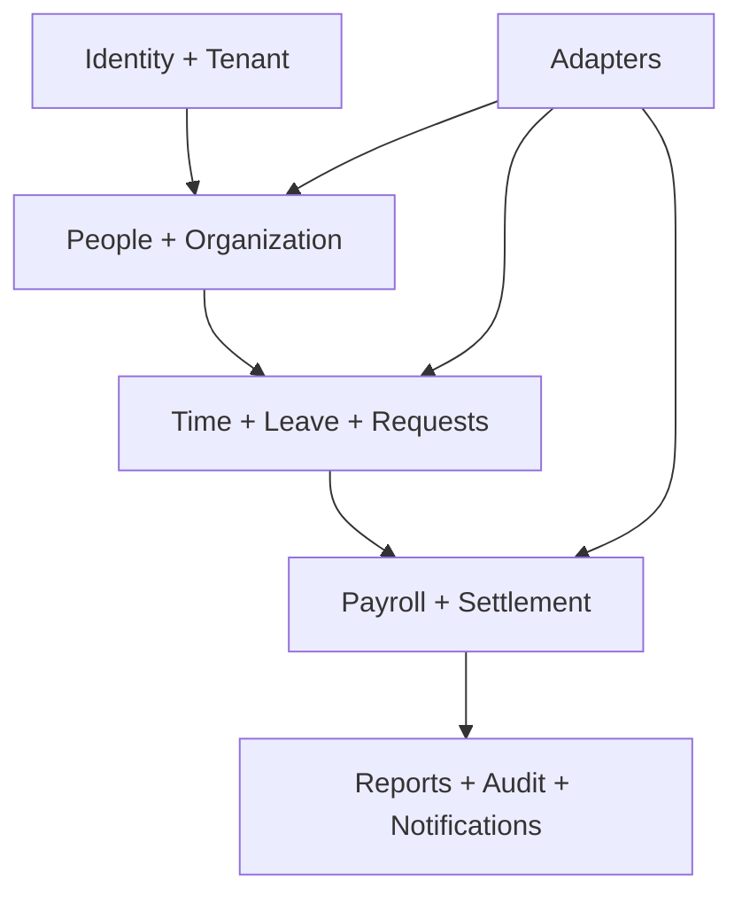

# خريطة مجالات المنتج وملكية البيانات

**التاريخ:** 8 سبتمبر 2026. **المرجع:** [PART 3 — Product Architecture](PART_03_PRODUCT_ARCHITECTURE.ar.md).

هذه الخريطة تمنع تداخل الشاشات والجداول. «المالك» هو المجال الوحيد الذي يغير الحقيقة الأساسية؛ المجالات الأخرى تقرأ snapshot أو تطلب Command موثقًا.

## 1. خريطة التدفق

المسار السفلي لا يعني أن التقارير تعدل الرواتب. الأحداث تنتقل من المصدر إلى read model؛ قرار مالي لا يصدر من الرسم البياني.

## 2. مالك الحقيقة وحدود القراءة

| المجال                | الكيانات الأساسية                                                                                | المالك                           | ما يقرأه                                         | ما لا يفعله                                           |
| --------------------- | ------------------------------------------------------------------------------------------------ | -------------------------------- | ------------------------------------------------ | ----------------------------------------------------- |
| Identity & Access     | users، profiles، invitations، memberships، role assignments، sessions                            | Identity                         | tenant status، employee link                     | لا يقرر قيمة راتب أو اعتماد طلب                       |
| Tenant & Organization | tenants، companies، subsidiaries، departments، locations، cost centers، holiday calendars        | Organization                     | memberships وpeople summary                      | لا يغيّر عقد موظف أو payslip                          |
| People & Employment   | people، employees، contracts، salary profiles، bank references، employment history               | People                           | org IDs، role scope                              | لا يعيد حساب punch أو يكتب payroll detail             |
| Time & Attendance     | shifts، assignments، punches، attendance days، corrections، overtime                             | Time                             | employee/contract/org snapshots                  | لا يخصم راتبًا مباشرة؛ يصدر approved facts            |
| Leave & Requests      | leave policies، balances، reservations، requests، approval chains، delegations                   | Leave/Workflow                   | employee manager، policy                         | لا يعدل payroll snapshot بعد القفل                    |
| Payroll & Finance     | payroll groups، runs، details، deductions، advances، installments، settlements، payment evidence | Payroll/Finance                  | approved facts، salary snapshot، org/cost center | لا يستبدل evidence بملف تصدير أو يحذف تاريخًا مدفوعًا |
| Documents & Assets    | private documents، versions، acknowledgments، assets، assignments، exit checks                   | Documents/Assets                 | employee and settlement reference                | لا يجعل رابط ملف عامًا ولا يقرر entitlement           |
| Reporting & Audit     | metric definitions، read models، audit events، exports                                           | Governance                       | snapshots/events من كل المجالات                  | لا يكتب المصدر كتصحيح صامت                            |
| Notifications         | templates، preferences، deliveries، retries                                                      | Notifications                    | event metadata ومتلقيًا مصرحًا                   | لا يغير قرارًا فشل إشعاره                             |
| Integrations          | connections، mappings، cursors، webhook receipts، jobs                                           | Integrations                     | source IDs وentity mapping                       | لا يملك employee/payroll truth؛ يطلب Commands         |
| Subscription          | plans، contracts، periods، invoices، usage، entitlements، support cases                          | Commerce                         | tenant identity وusage counts                    | لا يمنح role أو يعتمد مسيرًا                          |
| Learning Bridge       | employee mapping، enrollment/reference، completion reference                                     | Bridge مع المنتج التعليمي المالك | people stable IDs                                | لا ينسخ course content أو يغير employment             |

## 3. مفاتيح وربط الكيانات

| العلاقة                             | القاعدة                                                                                              |
| ----------------------------------- | ---------------------------------------------------------------------------------------------------- |
| tenant → legal entities             | `tenant_id` ثابت؛ entity يمكن أن تكون شركة أو فرعًا قانونيًا؛ uniqueness داخل tenant                 |
| employee → person/contract          | Person هو الفرد؛ Employee/Employment يحدد الكيان والعقد والتواريخ؛ لا نستخدم اسمًا كمفتاح            |
| employee → user                     | اختياري حتى الدعوة والتحقق؛ الحساب غير المرتبط لا يستعير سجلًا آخر                                   |
| employee → payroll                  | payroll detail يشير إلى employee وemployment/salary snapshot؛ لا يعتمد على الراتب الحالي بعد الإقفال |
| punch → attendance day              | punch خام immutable نسبيًا؛ المعالجة تنشئ attendance day بإصدار وقاعدة timezone/shift                |
| request → approval                  | request يملك الحالة؛ timeline يسجل القرارات؛ delegate مؤرخ ومحدود بالنطاق                            |
| leave reservation → request         | reservation مرتبط بطلب ومعاملة؛ لا يسمح بإرجاع حجز عشوائي بلا owner/status                           |
| loan → installment → payroll detail | القسط له سلفة وفترة ودليل تحصيل؛ لا يتكرر في مسيرين لنفس الفترة                                      |
| document → storage object           | DB يحتفظ metadata/version/status؛ object path يتضمن tenant ويخضع لرابط موقّع                         |
| subscription → entitlement          | entitlement يحمل plan version وperiod؛ لا يغير RBAC ولا tenant membership                            |
| event → aggregate                   | `aggregate_type/id/version` + idempotency key؛ المستهلك لا يعتمد ترتيبًا عالميًا                     |

## 4. واجهات المجالات

الأسماء التالية أسماء عقود مبدئية، وليست endpoints منفذة. يحدد PART 11 شكل JSON وpagination وerror codes.

| المجال         | Commands                                                                                   | Queries                                                                           |
| -------------- | ------------------------------------------------------------------------------------------ | --------------------------------------------------------------------------------- |
| Tenant         | `createTenant`, `inviteMember`, `publishOrganizationChange`                                | `getTenantContext`, `listEntities`, `listMemberships`                             |
| People         | `importEmployees`, `changeEmployment`, `linkUser`, `approveSalaryProfile`                  | `getEmployee360`, `listEmploymentHistory`, `getSalarySnapshot`                    |
| Time           | `publishSchedule`, `importPunchBatch`, `submitCorrection`, `decideOvertime`                | `listAttendanceExceptions`, `getShiftCoverage`, `getPunchTrace`                   |
| Leave/Workflow | `submitRequest`, `approveRequest`, `rejectRequest`, `cancelRequest`, `reserveBalance`      | `getRequestTimeline`, `getLeaveAvailability`, `listPendingApprovals`              |
| Payroll        | `createRun`, `calculateRun`, `reviewRun`, `lockRun`, `recordPayment`, `openReconciliation` | `getRunSummary`, `listPayrollDetails`, `getPaymentStatus`, `getSettlementPreview` |
| Documents      | `requestUpload`, `completeUpload`, `acknowledgeDocument`, `assignAsset`, `returnAsset`     | `listEmployeeDocuments`, `getSignedDownload`, `getExitChecklist`                  |
| Governance     | `generateReport`, `exportReport`, `appendAuditEvent`                                       | `getMetricDefinition`, `getAuditTrail`, `getReportRun`                            |
| Commerce       | `startTrial`, `activateSubscription`, `changePlan`, `cancelSubscription`                   | `getEntitlements`, `getUsage`, `listInvoices`                                     |
| Integrations   | `testConnection`, `enqueueSync`, `replayWebhook`                                           | `getConnectionHealth`, `getJobStatus`, `getMappingErrors`                         |

كل Command يعيد `command_id`, `status`, `correlation_id`, ونسخة مورد أو job؛ لا تعتمد الواجهة على رسالة نجاح فقط. Query يذكر `tenant_id` داخليًا ولا يسمح للعميل باختياره خارج memberships.

## 5. أحداث الأعمال المقترحة

| Event                    | المصدر        | المستهلكون                                    | شرط النشر                                 |
| ------------------------ | ------------- | --------------------------------------------- | ----------------------------------------- |
| `EmployeeHired.v1`       | People        | Access، Time، Learning Bridge، Analytics      | عقد مؤرخ وtenant صحيح                     |
| `AttendanceImported.v1`  | Time          | Exceptions، Payroll read model، Notifications | batch checksum وresult محفوظان            |
| `ExceptionResolved.v1`   | Time/Workflow | Payroll، Reports، Employee ESS                | القرار من صاحب نطاق صحيح                  |
| `LeaveSettled.v1`        | Leave         | Payroll، ESS، Reports                         | request/reservation/ledger في transaction |
| `PayrollCalculated.v1`   | Payroll       | Review، Reports، Payslip job                  | snapshot قابل لإعادة القراءة              |
| `PayrollLocked.v1`       | Payroll       | Payments، Payslip، Audit، Notifications       | القفل معتمد ولا تعارض مفتوح               |
| `PaymentRecorded.v1`     | Finance       | Reconciliation، ESS، Audit                    | مرجع فريد وإثبات صلاحية                   |
| `SettlementClosed.v1`    | Settlement    | Documents/Access، Reports، Notifications      | checklist وeligible amounts موثقة         |
| `SubscriptionChanged.v1` | Commerce      | Entitlement cache، Billing email، CS          | نسخة عقد وفترة وبند محفوظ                 |

النسخة `v1` لا تغير معناها في مكانها؛ تغيير schema ينشئ `v2` أو consumer adapter. لا تحمل الأحداث بيانات IBAN أو مستندًا أو راتبًا كاملًا؛ تحمل معرفًا وsummary مصرحًا، ويسترجع المستهلك ما يحتاجه من المصدر عبر نطاقه.

## 6. Read Models والتقارير

التقارير لا تعمل باستعلام حر على كل الجداول مع صلاحية المستخدم. نجهز views أو projection لكل وظيفة:

| Projection                     | يغذيه                                             | يستخدمه                               |
| ------------------------------ | ------------------------------------------------- | ------------------------------------- |
| `attendance_exception_summary` | schedule، punches، attendance decisions           | HR، المدير، لوحة الاستثناءات          |
| `leave_balance_snapshot`       | policy، accrual، reservations، settlements        | ESS، HR، payroll preview              |
| `payroll_run_summary`          | payroll run/details، approved facts، installments | Payroll، Finance، Executive dashboard |
| `payment_reconciliation_view`  | payments، bank evidence، run totals               | Finance، Auditor                      |
| `employee_360_view`            | person، employment، docs metadata، requests       | HR؛ حقول مقيدة حسب النطاق             |
| `subscription_usage_daily`     | managed people، storage، seats، periods           | Commerce، CS، invoice preview         |
| `audit_search_view`            | append-only audit events                          | Auditor، Security                     |

كل projection يحمل `as_of`, `source_versions`, `tenant_id`, و`generated_at`. إذا تأخر Worker، تعرض الواجهة وقت آخر تحديث والحالة `stale` بدل صفر أو قيمة قديمة بلا علامة.

## 7. قواعد تمنع التداخل

- لا يستورد مجال قواعد مجال آخر من ملف داخلي؛ يستخدم public contract أو event.
- لا يقرأ Report جدولًا حساسًا دون view/column allowlist ونطاق tenant.
- لا يغير Subscription دورًا أو policy؛ Commerce يعطي entitlement فقط.
- لا يغير Learning Bridge حالة عقد أو راتب؛ يرسل reference إلى People إذا احتاج تعديلًا معتمدًا.
- لا تعتبر Notification نتيجة العمل؛ فشل البريد لا يعيد request إلى Draft.
- لا يعاد حساب Payroll من بيانات متغيرة بعد lock؛ تفتح تسوية جديدة مع سبب.
- لا يستخدم Integrations service role لتجاوز workflow؛ adapter يمر command المالك أو transaction job محدد.
- لا يكتب Demo إلى قاعدة Live، ولا يستعمل mock employee لسد مدخل مالي.
